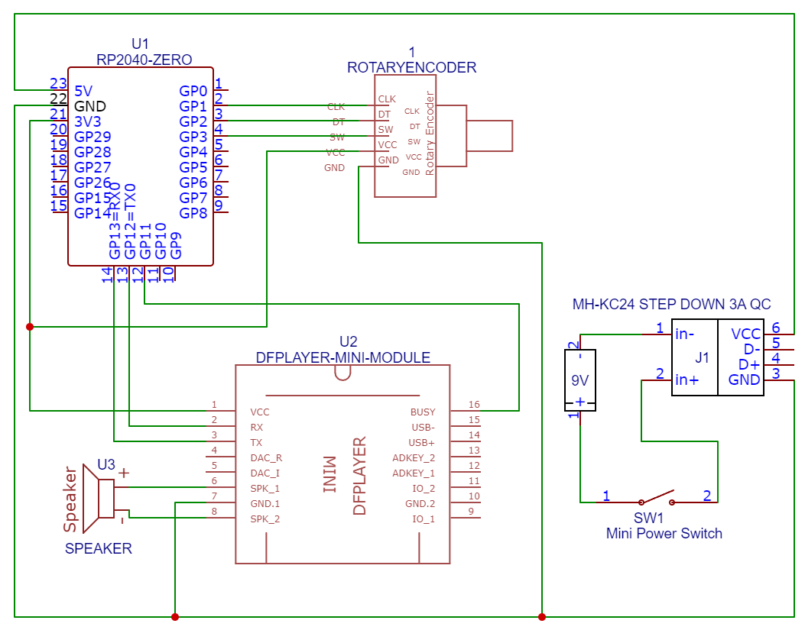

# team-spirit-portable
This device is a gift for leaving member of our team

## Features
* compact, portable, battery operated mp3 player with mono speaker
* has power switch and rotary encoder with push button
* plays random welcom message when powered on
* plays random work message when the button is pushed (without repeat until all available messages are played)
* volume can be changed by rotation of encoder
* long button press plays usage instructions

## MP3s organization and usage
* stored on Micro SD card (max 32GB) formatted FAT32 in MP3 directory
* naming convention - 0001.mp3 to xxxx.mp3, numbered continuously, 1000.mp3 is manual and 1001.mp3 is maximum volume warning
* mp3 can be 44100Hz, mono, any lenght, typicaly short, without leading and trailing delay without sound
* first 1 to N are welcome messages, N+1 to the last are work messages
* used serial command interface (init, play selected file, change volume)

## Used hardware parts
* RP2040-Zero development module with basic 2MB Flash, MicroPython Firmware
* DFPlayer Mini module with hardware MP3 decoder, mono 3W amplifier, MicroSD Card reader
* Switch button (power-on/off), terminal mounted
* Rotary encoder, terminal mounted
* wires for connections
* Universal double sided PCB board 3x7 cm
* M2 nylon standoff spacers 8x
* Plastic box 100x60x25 mm
* MicroSD Card 16GB
* DC Step-Down Module MH-KC24
* 9V battery
* 9V battery snap on connector
* 8 Ohm 2 Watt 40mm Speaker

## Construction
* RP2040 microcontroller and DFPlayer modules soldered directly to PCB
* PCB has holes in the corners - used standoffs to place it above the speaker
* box has two bigger holes, one for power switch (up), second for rotary encoder (on side)
* box has multiple small hols on front - for speaker noises
* speaker and DC convertor is fixed to the box using hot glue
* 9V battery can be removed, it is connected using snap connector

## Software
* MicroPython scripts uploaded to microcontroller using Thonny IDE
* Used standard library for DFPlayer and rotary encoder

## Schematics
